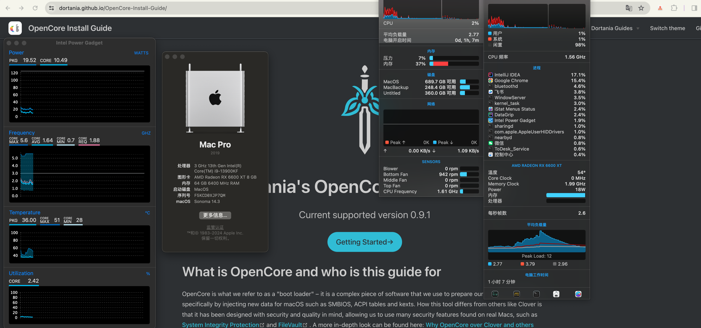
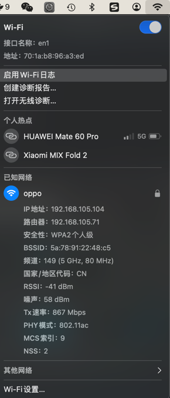

# Hackintosh-ASUS-Z790A-WIFID5-13900KF-6600XT-OpenCore0.9.8
 
# 硬件
- - -
+ 主板: ASUS/ROG-STRIX-Z790A-GAMING-WIFI
+ CPU: i9-13900KF
+ 内存: G.SKILL F5-6400J3239G32GX2-TZ5RS
+ 硬盘: SN850X
+ 显卡: ROG-STRIX-RX6600XT-O8G-GAMING
+ 无线网卡/蓝牙: AX210
+ 有线网卡：I226-V
- - -
自己按照https://dortania.github.io/OpenCore-Install-Guide/ 配置的，没有多余文件
除了隔空投送，随航不能用，一切完美

